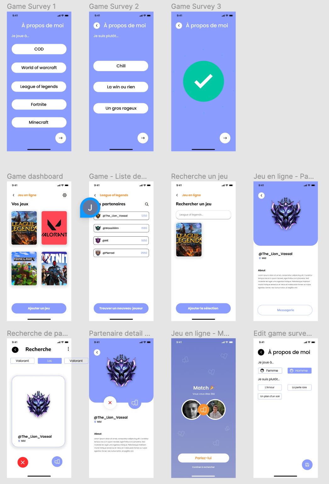

# Tamou

Meet the right person with this multi categories meeting mobile app (love, gaming, sport, study...).

## Figma 




## Technologies

- React Native
- Styled Components
- Redux / Redux-Saga

## Installation

- Follow the basic installation guide at https://reactnative.dev/docs/environment-setup
- Clone the project (you need to have the api project also)
- Copy ```.env.example``` into ```.env```
- Fill the values in ```.env```

## Running

- Open a new terminal and go to project
- Run ```npm install```
- Run ```cd ios && pod install && cd ..```
- Run ```npm run start```
- Open a new terminal window in the same folder
- Run ```npm run ios``` or ```npm run android```

## Troubleshoot

If you have problems with ios, you can
- Move to ios folder
- Remove ./Pods
- Remove Podfile.lock
- Run ```pod install```


If you have 'React-Native-Fetch-Blob' dependency cycles warnings, run 
- ```npm run fix-react-native-fetch-blob```
